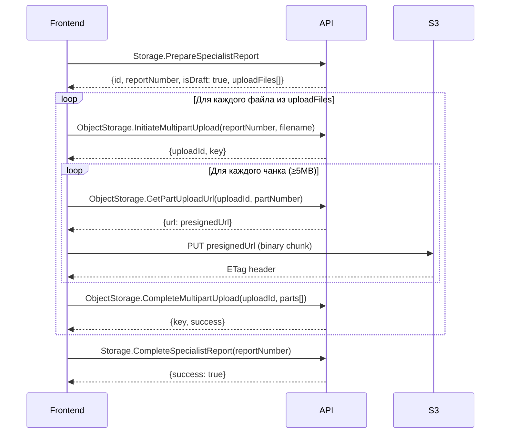

# Storage.PrepareSpecialistReport — API Documentation

> [!IMPORTANT]
> Документация для фронтенд-агента Claude Code. Описывает JSON-RPC метод создания черновика отчёта специалиста.

## Общая информация

| Параметр | Значение |
|---|---|
| **Метод** | `Storage.PrepareSpecialistReport` |
| **Протокол** | JSON-RPC 2.0 (POST) |
| **Авторизация** | `Authorization: Bearer <accessToken>` (тип токена: `AUTH`) |
| **Доступные роли** | `specialist`, `company` |
| **Ответ** | Черновик отчёта + список файлов для загрузки в S3 |

---

## Формат запроса

```json
{
  "jsonrpc": "2.0",
  "id": 1,
  "method": "Storage.PrepareSpecialistReport",
  "params": {
    "report": { ... }  // объект SpecialistReportDTO — обязательный
  }
}
```

### HTTP Headers

```
Content-Type: application/json
Authorization: Bearer <accessToken>
```

---

## Структура `params.report`

Корневой объект отчёта. Обязательные шаги: `reportName`, `carStep`, `characteristicsStep`, `documentReconciliationStep`, `legalReviewStep`, `inspectionStep`, `testDriveStep`, `resultStep`.

```typescript
interface Report {
  reportName: string;          // REQUIRED — название отчёта (NotBlank)
  reportDate?: string;         // формат "YYYY-MM-DD", по умолчанию — текущая дата
  carStep: CarStep;            // REQUIRED
  characteristicsStep: CharacteristicsStep; // REQUIRED
  documentReconciliationStep: DocumentReconciliationStep; // REQUIRED
  legalReviewStep: LegalReviewStep; // REQUIRED (может быть {})
  inspectionStep: InspectionStep;   // REQUIRED
  testDriveStep: TestDriveStep;     // REQUIRED
  resultStep: ResultStep;           // REQUIRED
}
```

---

## Шаги отчёта

### 1. `carStep` — Автомобиль

| Поле | Тип | Обязательное | Default | Описание |
|---|---|---|---|---|
| `vin` | `string` | ✅ NotBlank | — | VIN-номер (17 символов) |
| `unreadableVin` | `boolean` | ✅ NotNull | `false` | VIN нечитаемый |
| `gosNumber` | `string \| null` | ❌ | `null` | Госномер |
| `uriListing` | `string \| null` | ❌ | `null` | Ссылка на объявление |
| `mileage` | `integer` | ✅ NotBlank | — | Пробег (км) |
| `visuallyMileageNotMatchCondition` | `boolean` | ✅ NotNull | `false` | Визуально пробег не соответствует состоянию |
| `cityInspection` | `string` | ✅ NotBlank | — | Город осмотра |
| `dateInspection` | `string` | ✅ NotBlank | — | Дата осмотра (формат "YYYY-MM-DD") |

### 2. `characteristicsStep` — Характеристики

| Поле | Тип | Обязательное | Описание |
|---|---|---|---|
| `modelGenerationRestylingFrameId` | `integer \| null` | ❌ | ID рестайлинга+кузова из справочника |
| `engineVolume` | `number \| null` | ❌ | Объём двигателя (л) |
| `engineType` | `string \| null` | ❌ | Тип двигателя (бензин, дизель, электро, гибрид) |
| `transmission` | `string \| null` | ❌ | Трансмиссия (МКПП, АКПП, вариатор, робот) |
| `driveType` | `string \| null` | ❌ | Привод (передний, задний, полный) |
| `color` | `string \| null` | ❌ | Цвет |
| `equipment` | `string \| null` | ❌ | Комплектация |

### 3. `documentReconciliationStep` — Сверка документов

| Поле | Тип | Обязательное | Default | Описание |
|---|---|---|---|---|
| `ownersCount` | `integer \| null` | ❌ | `null` | Количество владельцев |
| `ownerFullNameMatchWithPTSOrSTS` | `boolean` | ✅ NotNull | `true` | ФИО совпадает с ПТС/СТС |
| `vinOnBodyMatchWithPTSOrSTS` | `boolean` | ✅ NotNull | `true` | VIN на кузове совпадает с ПТС/СТС |
| `engineModelMatchWithPTSOrSTS` | `boolean` | ✅ NotNull | `true` | Модель двигателя совпадает с ПТС/СТС |

### 4. `legalReviewStep` — Юридическая проверка

| Поле | Тип | Обязательное | Default | Описание |
|---|---|---|---|---|
| `otherLegalReviews` | `FileObject[]` | ❌ | `[]` | Файлы юридических документов |
| `legalReview` | `object \| array` | ❌ | `[]` | Данные юридической проверки (свободный объект) |

> [!TIP]
> Можно передать пустой объект `{}` — все поля имеют дефолтные значения.

### 5. `inspectionStep` — Осмотр (подробности ниже)

### 6. `testDriveStep` — Тест-драйв

| Поле | Тип | Обязательное | Default | Описание |
|---|---|---|---|---|
| `testDriveIsIncluded` | `boolean` | ✅ NotNull | — | Тест-драйв был проведён |
| `testDriveEngineIsWorkingProperly` | `boolean` | ✅ NotNull | — | Двигатель исправен |
| `testDriveEngineTags` | `int[]` | ❌ | `[]` | ID тегов неисправностей двигателя |
| `testDriveTransmissionIsWorkingProperly` | `boolean` | ✅ NotNull | — | Трансмиссия исправна |
| `testDriveTransmissionTags` | `int[]` | ❌ | `[]` | ID тегов неисправностей трансмиссии |
| `testDriveSteeringWheelIsWorkingProperly` | `boolean` | ✅ NotNull | — | Рулевое управление исправно |
| `testDriveSteeringWheelTags` | `int[]` | ❌ | `[]` | ID тегов неисправностей рулевого |
| `testDriveSuspensionInDriveIsWorkingProperly` | `boolean` | ✅ NotNull | — | Подвеска исправна |
| `testDriveSuspensionInDriveTags` | `int[]` | ❌ | `[]` | ID тегов неисправностей подвески |
| `testDriveBrakesInDriveIsWorkingProperly` | `boolean` | ✅ NotNull | — | Тормоза исправны |
| `testDriveBrakesInDriveTags` | `int[]` | ❌ | `[]` | ID тегов неисправностей тормозов |
| `testDriveNote` | `string \| null` | ❌ | `null` | Заметка по тест-драйву |

> [!WARNING]
> **Валидация тест-драйва:** Если `*IsWorkingProperly = false`, то соответствующий массив `*Tags` **обязан содержать хотя бы один тег**. Иначе — ошибка валидации.

### 7. `resultStep` — Итог

| Поле | Тип | Обязательное | Описание |
|---|---|---|---|
| `summaryInspectionNote` | `string` | ❌ | Краткое резюме осмотра |
| `resultSpecialistNote` | `string` | ✅ NotBlank | Заключение специалиста |

---

## Шаг `inspectionStep` — Детальная структура

`inspectionStep` содержит **8 секций**. Каждая секция — объект с коллекциями элементов осмотра.

### Общая типология секций

| Секция | Ключ JSON | Имеет `paintworkThickness` | Кол-во коллекций |
|---|---|---|---|
| Кузов | `bodySection` | ✅ | 15 |
| Силовые элементы кузова | `bodyReinforcementElementsSection` | ✅ | 15 |
| Стёкла | `glassSection` | ❌ | 8 |
| Интерьер | `interiorSection` | ❌ | 13 |
| Подкапотное пространство | `underHoodSpaceSection` | ❌ | 9 |
| Колёса и тормоза | `wheelsAndBrakesSection` | ❌ | 10 |
| Световое оборудование | `lightningSection` | ❌ | 8 |
| Компьютерная диагностика | `computerDiagnosticsSection` | ❌ | 12 |

### Секции с `paintworkThickness` (bodySection, bodyReinforcementElementsSection)

```json
{
  "bodySection": {
    "paintworkThicknessFrom": 80,    // integer, default 80
    "paintworkThicknessTo": 200,      // integer, default 200
    "bodyElementHoodCollection": [...],
    "bodyElementFrontBumperCollection": [...],
    // ... остальные коллекции
  }
}
```

### Секции без `paintworkThickness` (все остальные)

```json
{
  "glassSection": {
    "glassElementFrontCollection": [...],
    "glassElementFrontLeftCollection": [...],
    // ... остальные коллекции
  }
}
```

> [!TIP]
> Пустые секции можно передавать как `{}` — все коллекции имеют дефолтное значение `[]`.

---

### Полный список коллекций по секциям

#### `bodySection` (15 коллекций)
| Коллекция | Тип элемента |
|---|---|
| `bodyElementHoodCollection` | body/hood |
| `bodyElementFrontBumperCollection` | body/frontBumper |
| `bodyElementRearBumperCollection` | body/rearBumper |
| `bodyElementRoofCollection` | body/roof |
| `bodyElementTrunkCollection` | body/trunk |
| `bodyElementLeftFrontWingCollection` | body/leftFrontWing |
| `bodyElementRightFrontWingCollection` | body/rightFrontWing |
| `bodyElementRightRearWingCollection` | body/rightRearWing |
| `bodyElementLeftRearWingCollection` | body/leftRearWing |
| `bodyElementLeftFrontDoorCollection` | body/leftFrontDoor |
| `bodyElementLeftRearDoorCollection` | body/leftRearDoor |
| `bodyElementRightRearDoorCollection` | body/rightRearDoor |
| `bodyElementRightFrontDoorCollection` | body/rightFrontDoor |
| `bodyElementUnderHoodCollection` | body/underHood |
| `bodyElementInsideTrunkCollection` | body/insideTrunk |

#### `bodyReinforcementElementsSection` (15 коллекций)
| Коллекция |
|---|
| `bodyReinforcementElementFrontLeftPillarCollection` |
| `bodyReinforcementElementFrontRightPillarCollection` |
| `bodyReinforcementElementCenterRightPillarCollection` |
| `bodyReinforcementElementCenterLeftPillarCollection` |
| `bodyReinforcementElementRearLeftPillarCollection` |
| `bodyReinforcementElementRearRightPillarCollection` |
| `bodyReinforcementElementLeftSideBeamCollection` |
| `bodyReinforcementElementRightSideBeamCollection` |
| `bodyReinforcementElementLeftSillCollection` |
| `bodyReinforcementElementRightSillCollection` |
| `bodyReinforcementElementLeftFrontMudguardCollection` |
| `bodyReinforcementElementRightFrontMudguardCollection` |
| `bodyReinforcementElementLeftRearMudguardCollection` |
| `bodyReinforcementElementRightRearMudguardCollection` |
| `bodyReinforcementElementGeneralConditionCollection` |

#### `glassSection` (8 коллекций)
`glassElementFrontCollection`, `glassElementFrontLeftCollection`, `glassElementFrontRightCollection`, `glassElementRearRightCollection`, `glassElementRearLeftCollection`, `glassElementSideLeftCollection`, `glassElementSideRightCollection`, `glassElementGeneralConditionCollection`

#### `interiorSection` (13 коллекций)
`interiorElementFrontSeatsCollection`, `interiorElementRearSeatsCollection`, `interiorElementCeilingCollection`, `interiorElementTrunkCompartmentCollection`, `interiorElementSteeringWheelCollection`, `interiorElementDashboardCollection`, `interiorElementInstrumentClusterCollection`, `interiorElementCentralMonitorCollection`, `interiorElementClimateControlUnitCollection`, `interiorElementCenterConsoleCollection`, `interiorElementGearSelectorAreaCollection`, `interiorElementButtonsLeftOfSteeringWheelCollection`, `interiorElementGeneralConditionCollection`

#### `underHoodSpaceSection` (9 коллекций)
`underHoodElementEngineCollection`, `underHoodElementAttachmentsCollection`, `underHoodElementCoolingSystemCollection`, `underHoodElementIntakeOrTurbineCollection`, `underHoodElementReleaseOrEcologyCollection`, `underHoodElementElectricsCollection`, `underHoodElementBrakingSystemCollection`, `underHoodElementSteeringControlCollection`, `underHoodElementGeneralConditionCollection`

#### `wheelsAndBrakesSection` (10 коллекций)
`wheelsAndBrakesElementFrontLeftWheelCollection`, `wheelsAndBrakesElementFrontRightWheelCollection`, `wheelsAndBrakesElementRearLeftWheelCollection`, `wheelsAndBrakesElementRearRightWheelCollection`, `wheelsAndBrakesElementSpareWheelCollection`, `wheelsAndBrakesElementFrontLeftBrakeCollection`, `wheelsAndBrakesElementFrontRightBrakeCollection`, `wheelsAndBrakesElementRearLeftBrakeCollection`, `wheelsAndBrakesElementRearRightBrakeCollection`, `wheelsAndBrakesElementGeneralConditionCollection`

#### `lightningSection` (8 коллекций)
`lightningElementFrontLightsCollection`, `lightningElementRearLightsCollection`, `lightningElementDaytimeRunningLightsCollection`, `lightningElementFogLightsCollection`, `lightningElementTurnSignalsCollection`, `lightningElementBrakeLightsCollection`, `lightningElementNumberPlateLightsCollection`, `lightningElementGeneralConditionCollection`

#### `computerDiagnosticsSection` (12 коллекций)
`computerDiagnosticsElementEngineCollection`, `computerDiagnosticsElementTransmissionCollection`, `computerDiagnosticsElementAbsEspBrakeCollection`, `computerDiagnosticsElementSrsAirbagCollection`, `computerDiagnosticsElementElectricalCollection`, `computerDiagnosticsElementEcologyExhaustCollection`, `computerDiagnosticsElementBodyElectronicsCollection`, `computerDiagnosticsElementSteeringSuspensionCollection`, `computerDiagnosticsElementFourWheelDriveCollection`, `computerDiagnosticsElementClimateCollection`, `computerDiagnosticsElementImmobilizerCollection`, `computerDiagnosticsElementGeneralConditionCollection`

---

## Структура элемента осмотра

Каждый элемент в коллекции — объект. Два типа: **body-элемент** (с paintworkThickness) и **inspection-элемент** (без paintworkThickness).

### Body-элемент (bodySection, bodyReinforcementElementsSection)

```typescript
interface BodyElement {
  file?: FileObject | null;           // Файл (фото/видео/документ)
  paintworkThicknessFrom?: number;    // Default: 80
  paintworkThicknessTo?: number;      // Default: 200
  noDamage?: boolean;                 // Default: true
  seriousDamageTags?: int[];          // ID тегов серьёзных повреждений, default: []
  noSeriousDamageTags?: int[];        // ID тегов незначительных повреждений, default: []
  note?: string | null;               // Заметка
  audioNotes?: string[];              // Имена файлов аудиозаметок, default: []
}
```

### Inspection-элемент (все остальные секции)

```typescript
interface InspectionElement {
  file?: FileObject | null;           // Файл (фото/видео/документ)
  noDamage?: boolean;                 // Default: true
  seriousDamageTags?: int[];          // ID тегов серьёзных повреждений, default: []
  noSeriousDamageTags?: int[];        // ID тегов незначительных повреждений, default: []
  note?: string | null;               // Заметка
  audioNotes?: string[];              // Имена файлов аудиозаметок, default: []
}
```

### FileObject

```typescript
interface FileObject {
  filename: string;    // Имя файла с расширением
  type: "image" | "video" | "document";
}
```

**Допустимые расширения:** `jpg`, `jpeg`, `png`, `webp`, `heic`, `mp4`, `mov`, `avi`, `pdf`, `doc`, `docx`

> [!CAUTION]
> **Критическое правило файлозависимых полей:** Поля `noDamage`, `seriousDamageTags`, `noSeriousDamageTags`, `note`, `audioNotes` в элементах осмотра **принимаются только при наличии файла** (`file.filename` должен быть непустой строкой). Без файла:
> - `noDamage` нельзя устанавливать в `false`
> - `seriousDamageTags` и `noSeriousDamageTags` должны быть пустыми
> - `note` должен быть `null`
> - `audioNotes` должен быть пустым

> [!WARNING]
> **Валидация повреждений:** Если `noDamage = false` и файл присутствует, **обязательно** передать хотя бы один тег в `seriousDamageTags` или `noSeriousDamageTags`. Иначе — ошибка валидации.

---

## Ответ (Response)

```json
{
  "jsonrpc": "2.0",
  "id": 1,
  "result": {
    "id": 42,                          // integer — ID созданного отчёта
    "reportNumber": "N000042",         // string — номер отчёта
    "isDraft": true,                   // boolean — всегда true после создания
    "uploadFiles": [                   // массив файлов для загрузки в S3
      {
        "filename": "hood_photo.jpg",
        "key": "N000042/hood_photo.jpg",   // S3-ключ = {reportNumber}/{filename}
        "type": "image",
        "stepType": "body"                 // тип секции (body, glass, legalReview, etc.)
      }
    ]
  }
}
```

| Поле | Тип | Описание |
|---|---|---|
| `id` | `integer` | ID созданного отчёта |
| `reportNumber` | `string` | Номер отчёта (формат `{N}000000`) |
| `isDraft` | `boolean` | Всегда `true` после создания |
| `uploadFiles` | `FileObject[]` | Список файлов для загрузки в S3 |
| `uploadFiles[].filename` | `string` | Имя файла (как было в запросе) |
| `uploadFiles[].key` | `string` | S3-ключ: `{reportNumber}/{filename}` |
| `uploadFiles[].type` | `string` | `image` / `video` / `document` |
| `uploadFiles[].stepType` | `string` | Тип секции (`body`, `bodyReinforcement`, `glass`, `legalReview`, etc.) |

---

## Коды ошибок

| Код | Описание |
|---|---|
| `401` | Unauthorized — отсутствует или невалидный Bearer-токен |
| `403` | Forbidden — роль пользователя не входит в список разрешённых (`specialist`, `company`) |

---

## Полный рабочий пример запроса

```json
{
  "jsonrpc": "2.0",
  "id": 3,
  "method": "Storage.PrepareSpecialistReport",
  "params": {
    "report": {
      "reportName": "Осмотр Toyota Camry",
      "carStep": {
        "vin": "JTDKN3DU5A0000001",
        "mileage": 95000,
        "cityInspection": "Москва",
        "dateInspection": "2025-01-15"
      },
      "characteristicsStep": {
        "modelGenerationRestylingFrameId": 1,
        "engineVolume": 2.5,
        "engineType": "бензин",
        "transmission": "АКПП",
        "driveType": "передний",
        "color": "белый",
        "equipment": "Комфорт"
      },
      "documentReconciliationStep": {
        "ownersCount": 2,
        "ownerFullNameMatchWithPTSOrSTS": true,
        "vinOnBodyMatchWithPTSOrSTS": true,
        "engineModelMatchWithPTSOrSTS": true
      },
      "legalReviewStep": {},
      "inspectionStep": {
        "bodySection": {
          "paintworkThicknessFrom": 80,
          "paintworkThicknessTo": 200,
          "bodyElementHoodCollection": [
            {
              "file": {
                "filename": "hood_photo.jpg",
                "type": "image"
              },
              "noDamage": true
            }
          ],
          "bodyElementFrontBumperCollection": [
            {
              "file": {
                "filename": "front_bumper.jpg",
                "type": "image"
              },
              "noDamage": false,
              "seriousDamageTags": [12, 15],
              "note": "Глубокая царапина на левой части"
            }
          ]
        },
        "bodyReinforcementElementsSection": {
          "paintworkThicknessFrom": 80,
          "paintworkThicknessTo": 200
        },
        "glassSection": {},
        "interiorSection": {},
        "underHoodSpaceSection": {},
        "wheelsAndBrakesSection": {},
        "lightningSection": {},
        "computerDiagnosticsSection": {}
      },
      "testDriveStep": {
        "testDriveIsIncluded": true,
        "testDriveEngineIsWorkingProperly": true,
        "testDriveTransmissionIsWorkingProperly": true,
        "testDriveSteeringWheelIsWorkingProperly": true,
        "testDriveSuspensionInDriveIsWorkingProperly": true,
        "testDriveBrakesInDriveIsWorkingProperly": true
      },
      "resultStep": {
        "summaryInspectionNote": "Автомобиль в хорошем состоянии, мелкие повреждения кузова.",
        "resultSpecialistNote": "Рекомендую к покупке с учётом торга на устранение царапины переднего бампера."
      }
    }
  }
}
```

---

## Минимальный запрос (все опциональные поля опущены)

```json
{
  "jsonrpc": "2.0",
  "id": 1,
  "method": "Storage.PrepareSpecialistReport",
  "params": {
    "report": {
      "reportName": "Осмотр авто",
      "carStep": {
        "vin": "JTDKN3DU5A0000001",
        "mileage": 50000,
        "cityInspection": "Москва",
        "dateInspection": "2025-03-01"
      },
      "characteristicsStep": {},
      "documentReconciliationStep": {},
      "legalReviewStep": {},
      "inspectionStep": {
        "bodySection": {},
        "bodyReinforcementElementsSection": {},
        "glassSection": {},
        "interiorSection": {},
        "underHoodSpaceSection": {},
        "wheelsAndBrakesSection": {},
        "lightningSection": {},
        "computerDiagnosticsSection": {}
      },
      "testDriveStep": {
        "testDriveIsIncluded": false,
        "testDriveEngineIsWorkingProperly": true,
        "testDriveTransmissionIsWorkingProperly": true,
        "testDriveSteeringWheelIsWorkingProperly": true,
        "testDriveSuspensionInDriveIsWorkingProperly": true,
        "testDriveBrakesInDriveIsWorkingProperly": true
      },
      "resultStep": {
        "resultSpecialistNote": "Заключение специалиста."
      }
    }
  }
}
```

---

## Флоу после создания отчёта



> [!NOTE]
> **Ключевое правило:** Имена файлов (`filename`) и `reportNumber` при загрузке в S3 должны совпадать с теми, что были возвращены в `uploadFiles`. S3-ключ формируется как `{reportNumber}/{filename}`.

---

## Правила валидации (сводка)

1. **`reportName`** — не может быть пустым
2. **`carStep.vin`** — не может быть пустым
3. **`carStep.mileage`** — не может быть пустым
4. **`carStep.cityInspection`** — не может быть пустым
5. **`carStep.dateInspection`** — не может быть пустым
6. **`resultStep.resultSpecialistNote`** — не может быть пустым
7. **Элементы осмотра без файла** — `noDamage` должен быть `true`, теги и заметки должны быть пустыми
8. **Элементы осмотра с файлом и `noDamage=false`** — обязателен хотя бы один тег в `seriousDamageTags` или `noSeriousDamageTags`
9. **Тест-драйв: `*IsWorkingProperly=false`** — обязательны соответствующие теги
10. **`file.filename`** — должен заканчиваться на допустимое расширение (jpg|jpeg|png|webp|heic|mp4|mov|avi|pdf|doc|docx)
11. **`file.type`** — допустимые значения: `image`, `video`, `document`
12. **Теги** — массивы `int[]` (ID тегов, получаемые через `Storage.GetUserTags`)
